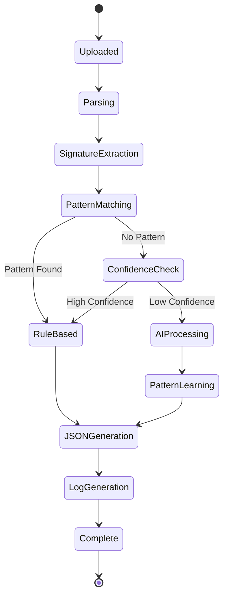

# Multi-Format Document Parser - Technical Architecture

## Processing States

## Key Technical Components

| Component | Technology | Function |
|-----------|------------|----------|
| **Frontend** | Streamlit | Web UI, File Upload, Results Display |
| **Parser Engine** | PyPDF2, python-docx, BeautifulSoup4 | Multi-format document parsing |
| **AI Engine** | Google Gemini 1.5 Flash | Complex document understanding |
| **Rule Engine** | Python Regex, Pattern Matching | Fast rule-based extraction |
| **Schema Validation** | Pydantic | Data model validation |
| **Storage** | JSON Files | Pattern persistence |
| **Orchestration** | Python Classes | Pipeline coordination |